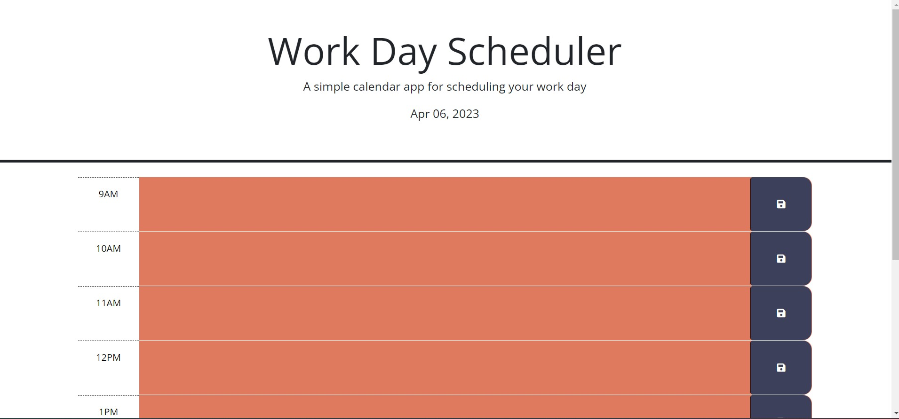

# WorkDayScheduler

## Description
An application to keep track of your daily To-Dos by the hour from 9am-5pm. The current date is displayed in the header of the page. Red boxes indicate hours that have passed, white indicates the current hour, and green indicates future hours. All text written in the application is saved to local storage so the user can refresh or close out of the webpage without losing their data. There is a save button for each hour so the user can change their tasks individually.

## Usage

To use this page, input your daily To-Dos and press the save icon on the end of the row. 

[Click here](https://emilymclean94.github.io/WorkDayScheduler/) to see the deployed application.

## Credits

Thank you to my classmates, instructor, TA, and tutors!! You were incredibly helpful!

